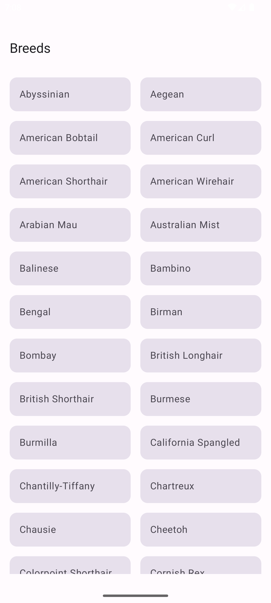
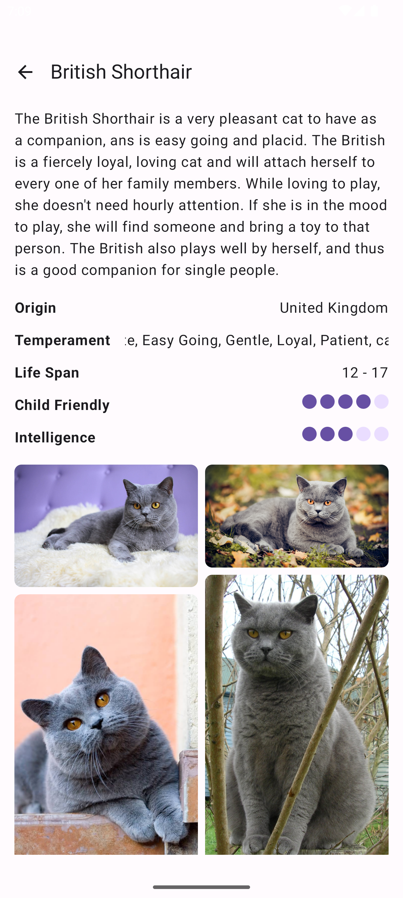

# Octopus Energy Technical Challenge

## About
This project contains the technical challenge for applying to Octopus Energy, UK. The task was to interface with a public Cat Breed API and show these results to a user. 
Selecting a breed would show a detail page showing various information about the selected cat breed.

## Features
- Application Modules to separate areas of concern.
- Network requests to [The CatAPI](https://thecatapi.com).
- Session caching
  - Breeds are cached for the session using a map within `BreedRepository`.
  - Images URLs are also cached - with images being cached by Coil.

## Tech Stack
- Kotlin 2.0
- UI -> [Jetpack Compose](https://developer.android.com/compose)
- Images -> [Coil](https://coil-kt.github.io/coil/)
- Networking -> [Retrofit](https://square.github.io/retrofit/)
- Concurrency -> [Coroutines](https://kotlinlang.org/docs/coroutines-overview.html), [Flow](https://developer.android.com/kotlin/flow)
- Dependency Injection -> [Hilt](https://dagger.dev/hilt/)
- Unit Testing -> [Mockito](https://github.com/mockito/mockito)

## Output

    
    

## What could be improved?
- A more robust caching solution using Room or Realm could allow for cross-session caching.
- Better error handling on screens when data is not available (A retry button, for example)
- The initial list screen could show the user a single image of a breed before making a selection.
- Demonstration of a UI test using the compose ui testing library could have been completed, if time allowed.
